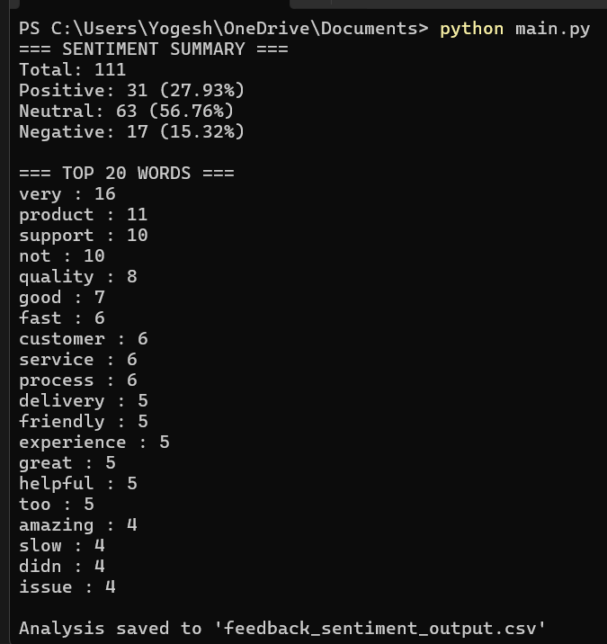

# Customer Feedback Sentiment Analysis (Rule-Based)

This project analyzes customer feedback comments using simple Python rules to identify
whether each comment is **Positive**, **Neutral**, or **Negative**.  
It does not use machine learning — only basic text processing and keyword matching —
making it easy to understand and suitable for entry-level analyst roles.

---

## 📌 Project Overview
- Loaded 100 customer feedback comments from a CSV file.
- Cleaned the text by removing punctuation, converting to lowercase, and standardizing it.
- Used a **rule-based method** to classify each comment as:
  - Positive  
  - Neutral  
  - Negative
- Calculated:
  - Total number of reviews  
  - Percentage of positive, neutral, and negative comments  
- Extracted the **top most common words** used by customers.
- Generated an output CSV file with:
  - Original feedback  
  - Cleaned text  
  - Sentiment label  

---

## 🧠 Why This Project?
This project demonstrates:
- Basic **Python** and **Pandas** skills  
- Ability to clean and handle text data  
- Understanding of customer sentiment  
- Analytical thinking  
- Reporting and quality checking skills  

Perfect for **Quality Business Analyst** or **Data Analyst** roles.

---

## 🖼 Demo Output
Below is an example of the result generated by the script:



---

## 🛠 Technologies Used
- Python  
- Pandas  
- Regular Expressions (re)  
- CSV File Handling  

---

## 📂 Files in This Project
- `customer_feedback.csv` → Input dataset (100 customer comments)  
- `analysis.py` → Python script  
- `feedback_sentiment_output.csv` → Output file containing sentiment labels  
- `demo.png` → Screenshot of script output  

---

## 🚀 How to Run
1. Install Python 3  
2. Install Pandas:
   ```bash
   pip install pandas
